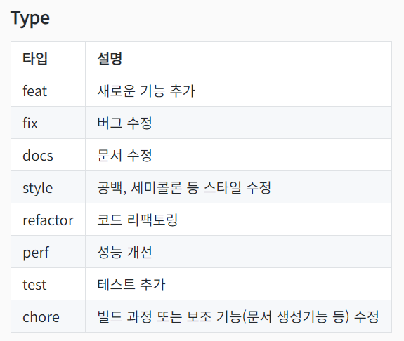
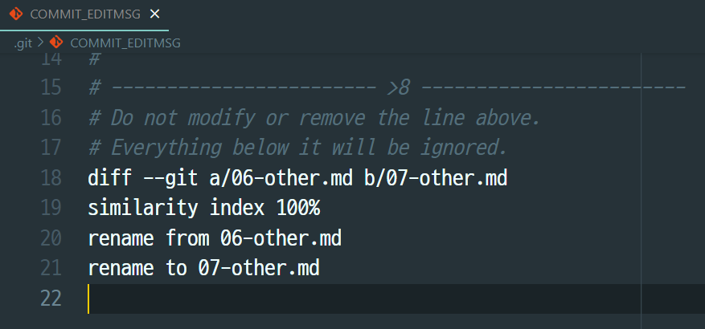
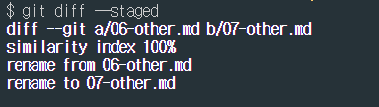

# Commit 

## Commit message convention
주로 사용되는 방식
```plaintext
type: subject

body (optional)
...
...
...

footer (optional)
```
**Type**  
커밋의 작업내용 간략히 설명   

**Body**   
길게 설명할 필요가 있을 시 작성   

**Footer**
- Breaking Point 가 있을 때
- 특정 이슈에 대한 해결 작업일 때



## 변경사항 확인하고 커밋
```bash
git commit -v
```

```bash
git diff --staged
```
